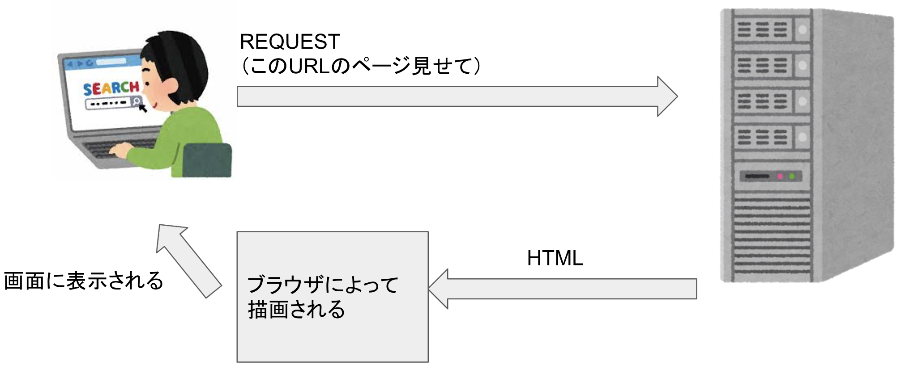

---?color=#E58537
@snap[north-west]
#### **拡張の方向性、方法は自由！**
@snapend
@snap[west span-100]
@ul[text-white](false)
- 今回紹介したプログラムの機能拡張をする
- GUIで操作できるようにする
- DBに対応する
- @color[cyan](***データの取得方法を工夫する（Webスクレイピング）***)
- Web APIに対応する
- @color[cyan](***形態素解析を用いた自然言語処理***)
- word2vecの学習モデルの精度や対応する単語を増やす
@ulend
@snapend

---?color=#E58537
@snap[north-west]
#### **データの収集自動化（静的サイトのWebスクレイピング）**
ブラウザでサイトが開かれるまでの簡略図


@snapend

---?color=#E58537
#### **HTMLの描画例**
@snap[west span-40]
@code[html zoom-07](hoge.html)
@snapend

---?color=#E58537
@snap[north-west]
#### **pythonでWebスクレイピング（静的なサイト）**
@snapend
```python
from bs4 import BeautifulSoup
import requests

url = "https://www.e-hon.ne.jp/bec/SE/Genre?ccode=99&dcode=06"
response = requests.get(url)
response.encoding = response.apparent_encoding
soup = BeautifulSoup(response.text,"html.parser")

# 本のタイトルを取得
books = [a.text for a in soup.select("div.rankInner a")]
```
---?color=#E58537
@snap[north-west]
#### **データの収集自動化（動的サイトのWebスクレイピング）**
@snapend

---?color=#E58537
@snap[north-west]
#### **先程の本のランキングサイトが動的サイトの場合**
@snapend

---?color=#E58537
@snap[north-west]
##### **PythonでWebスクレイピング（動的なサイト）**
@snapend
```python
from bs4 import BeautifulSoup
from selenium import webdriver
from selenium.webdriver.firefox.options import Options

url = "https://www.amazon.co.jp/gp/bestsellers/books/ref=zg_bs_books_pg_1?ie=UTF8&pg=1"
browser = webdriver.PhantomJS()
browser.implicitly_wait(3)
browser.get(url)
html_source = browser.page_source
bs_obj = BeautifulSoup(html_source)
books = [a.text for a in bs_obj.select("div.a-fixed-left-grid-col div.p13n-sc-truncated")]
```

---?color=#E58537
@snap[north-west]
##### **趣味に近い本の算出方法**
@snapend
```python
tokenized_text = mecab.parse('ハリーポッターと賢者の石').split('\n')[0:-2]
surfaces = [t.split('\t')[0] for t in tokenized_text]
poses = [t.split('\t')[3].split('-')[0] for t in tokenized_text]
morphs = [{"surface":s, "pos":p} for (s,p) in zip(surfaces,poses)]
for m in morphs:
  print(m)

# {'surface': 'ハリーポッター', 'pos': '名詞'}
# {'surface': 'と', 'pos': '助詞'}
# {'surface': '賢者', 'pos': '名詞'}
# {'surface': 'の', 'pos': '助詞'}
# {'surface': '石', 'pos': '名詞'}
```
---?color=#E58537
@snap[north-west]
##### **現状のクラス**
@snapend
---?color=#E58537
@snap[north-west]
##### **改良1：学生証をチャージ機に入れた時、おみくじ機能をつける**
@snapend
**おみくじ機能の発行条件**
直前にチャージした人の趣味と、チャージした人の趣味が近ければ良い結果のおみくじを、遠ければ悪い結果のおみくじを発行する

---?color=#E58537
@snap[north-west]
##### **メソッドの機能**
**StudentCard**
get_student_hobboy()
→学生のhobbyを返す
**MainShopCharger**
pick_fortune()
→直前にチャージした人と今チャージした人の趣味の類似度を計算し、類似度が高ければおみくじで良い結果を悪ければおみくじの結果を悪くする
@snapend
---?color=#E58537
@snap[north-west]
##### **実装（趣味の類似度算出部分）**
@snapend
---?color=#E58537
@snap[north-west]
##### **実装結果**
@snapend
---?color=#E58537
@snap[north-west]
##### **改良2：学生におすすめの本を表示する**
@snapend
**おすすめの条件**
学生の趣味と、販売されている全ての本（今回は100冊）のタイトルの類似度を算出し、類似度が一番高いTOP3を表示する
---?color=#E58537
@snap[north-west]
##### **メソッドの機能**
@snapend
get_student_hobby()
→学生のhobbyを返す
insert_student_card()
→学生証をShopRegistrに差し込む（MainShopChargerのものと同じ機能）
recommended()
→販売されている本の中から学生の趣味に近いものTOP3を抜粋し表示
---?color=#E58537
@snap[north-west]
##### **趣味に近い本の算出方法**
@snapend

