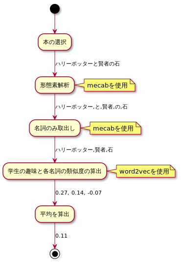

@snap[north-west]
#### **拡張の方向性、方法は自由！**
@snapend
@snap[west span-100]
@ul[](false)
- 今回紹介したプログラムの機能拡張をする
- GUIで操作できるようにする
- DBに対応する
- @color[orange](***データの取得方法を工夫する（Webスクレイピング）***)
- Web APIに対応する
- @color[orange](***形態素解析を用いた自然言語処理***)
- word2vecの学習モデルの精度や対応する単語を増やす
@ulend
@snapend

---
@snap[north-west]
#### **付録一覧**
@snapend
@snap[west span-100]
@ul[](false)
- 静的Webサイトの例
- 動的Webサイトの例
- 静的サイトのスクレイピングプログラム
- 動的サイトのスクレイピングプログラム
- 形態素解析により、形態素に切り分け、品詞をとくていするプログラム
- 改良1のプログラム
- 改良2のプログラム
@ulend

---
@snap[north-west]
#### **①静的サイトのWebスクレイピング**
ブラウザでサイトが開かれるまでの簡略図
@snapend
<br><br>


---
@snap[north-west]
#### **@color[orange](①HTMLの描画例) [@color[orange](@fa[desktop])](https://kd21.github.io/in-60-seconds/) [@color[orange](@fa[file-code-o])](https://github.com/kd21/in-60-seconds/tree/master/docs)**
@snapend
<a href="https://kd21.github.io/in-60-seconds/">

</a>
---
@snap[north-west]
#### **①pythonで静的なサイトのWebスクレイピング**
@snapend
```python
from bs4 import BeautifulSoup
import requests

url = "https://www.e-hon.ne.jp/bec/SE/Genre?ccode=99&dcode=06"
response = requests.get(url)
response.encoding = response.apparent_encoding
soup = BeautifulSoup(response.text,"html.parser")

# 本のタイトルを取得
books = [a.text for a in soup.select("div.rankInner a")]
```
---
@snap[north-west]
#### **②動的サイトのWebスクレイピング**
ブラウザでサイトが開かれるまでの簡略図
@snapend
<br><br>


---
@snap[north-west]
#### **②例のサイトが動的サイトの場合　[@color[orange](@fa[desktop])](https://kd21.github.io/in-60-seconds/) [@color[orange](@fa[file-code-o])](https://github.com/kd21/in-60-seconds/tree/master/docs)**
@snapend
<table border="0">
<tr>
<td><a href="https://kd21.github.io/in-60-seconds/">

</a></td>
<td>←</td>
<td><a href="https://kd21.github.io/in-60-seconds/">

</a></td>
</tr>
</table>

---
@snap[north-west]
##### **②Pythonで動的なサイトのWebスクレイピング**
@snapend
```python
from bs4 import BeautifulSoup
from selenium import webdriver
from selenium.webdriver.firefox.options import Options

url = "https://www.amazon.co.jp/gp/bestsellers/books/ref=zg_bs_books_pg_1?ie=UTF8&pg=1"
browser = webdriver.PhantomJS()
browser.implicitly_wait(3)
browser.get(url)
html_source = browser.page_source
bs_obj = BeautifulSoup(html_source)
books = [a.text for a in bs_obj.select("div.a-fixed-left-grid-col div.p13n-sc-truncated")]
```

---
@snap[north-west]
##### **③形態素解析**
@snapend
```python
tokenized_text = mecab.parse('ハリーポッターと賢者の石').split('\n')[0:-2]
surfaces = [t.split('\t')[0] for t in tokenized_text]
poses = [t.split('\t')[3].split('-')[0] for t in tokenized_text]
morphs = [{"surface":s, "pos":p} for (s,p) in zip(surfaces,poses)]
for m in morphs:
  print(m)

# {'surface': 'ハリーポッター', 'pos': '名詞'}
# {'surface': 'と', 'pos': '助詞'}
# {'surface': '賢者', 'pos': '名詞'}
# {'surface': 'の', 'pos': '助詞'}
# {'surface': '石', 'pos': '名詞'}
```
---
@snap[north-west]
##### **現状のクラス**

@snapend

---
@snap[north-west]
##### **改良1：チャージ機におみくじ機能をつける**
<br>
###### おみくじ機能の発行条件
@ul(false)
- 直前にチャージした人の趣味と、チャージした人の趣味の距離によって、運勢を算出
- 一番最初にチャージした人は大吉
@ulend
@snapend

---
@snap[north-west]
##### **改良1：クラスの構成**

@snapend

---
@snap[north-west]
##### **改良1：実装（趣味の類似度算出部分）**
@snapend


---
@snap[north-west]
##### **改良1：実装結果**
@snapend


---
@snap[north-west]
##### **改良2：学生におすすめの本を表示する**
<br>
##### おすすめの条件
学生の趣味と、販売されている本（100冊）のタイトルの全類似度を算出し、類似度TOP3を表示
@snapend

---
@snap[north-west]
##### **改良2：クラスの構成**
新たにShopRegisterというクラスを作成する

@snapend

---
@snap[north-west]
##### **改良2：趣味に近い本の算出方法**
@snapend
<br>


---
@snap[north-west]
##### **改良2：実装結果**
@snapend

